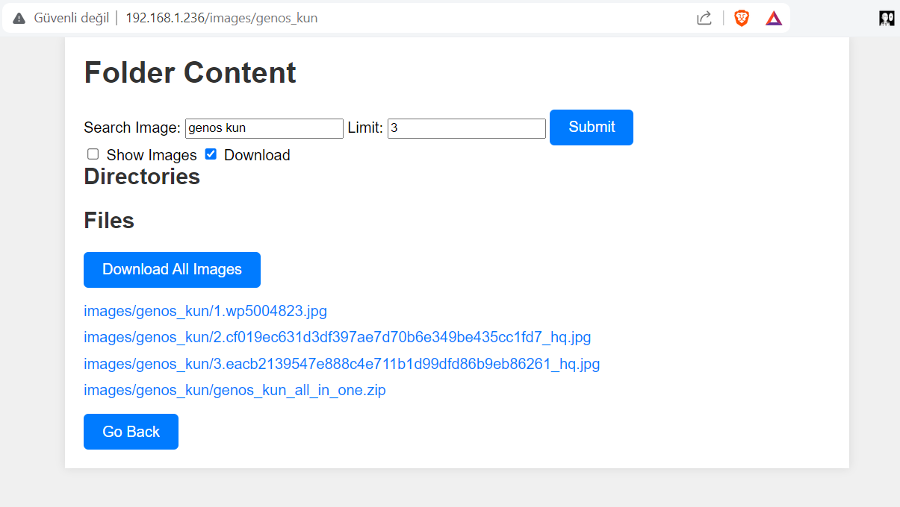
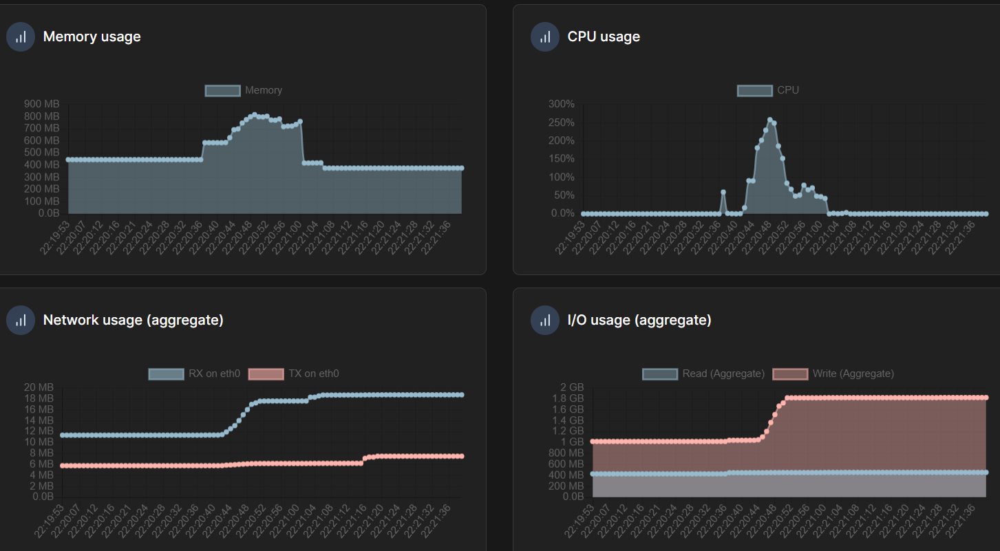

# 🐳 Download Images From Internet Using Docker<br>

This repo is based on <a href="https://github.com/ultralytics/google-images-download">ultralytics repository</a><br>

Here is a Docker Hub link: <a href="https://hub.docker.com/r/saitamatechno/google_images_download">saitamatechno/google_images_download</a><br>

## Docker Run<br>

```bash
docker run -d -p 80:80 --name image_searcher saitamatechno/google_images_download:latest
```
## Docker Build<br>
```bash
docker build -t google_images_download .
```

## Docker Remove<br>
```bash
docker stop image_searcher && docker rm image_searcher
```
## Control via Website<br>
go to the main url (your local url) for example:<br>
http://192.168.1.236<br>
Web Interface<br>
Note: When show images option is enabled and if you hover your mouse onto the image links the image will pop up amazingly :) <br>


<br>

## Control via Python Api<br>
<p>Get request to this url: <br>
http://192.168.1.236/search?limit=3&search=genos%20kun&gui=0</p>
<br>

<pre> <code>
#check request1.py

from request1 import get_image_links

search_term="dragonball super"
main_url="http://192.168.1.236"
image_links=get_image_links(main_url, search_term)
print(image_links)
</code></pre>

## Source Usage <br>
Source usage for 3 images <br>
<br>
